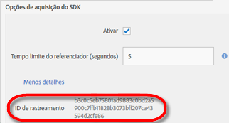

# Criar links de aquisição manualmente {#create-acquisition-link-manually}

É possível criar links de marketing para adquirir novos usuários de aplicativos móveis de maneira rápida configurando manualmente os parâmetros do URL.

>[!IMPORTANT]
>
>Este recurso exige a versão 4.6 ou posterior do SDK. Para obter mais informações, consulte [Pré-requisitos de aquisição](/help/using/acquisition-main/c-acquisition-prerequisites.md).

O diagrama a seguir mostra os componentes de um link de rastreamento criado manualmente e os diferentes parâmetros de URL que você deve configurar de forma correta na criação manual de links de aquisição.

Esse link é configurado para executar um redirecionamento específico da plataforma para a Google Play Store ou a Apple App Store para um aplicativo móvel. Se não for possível determinar o destino, a loja padrão será definida como Apple App Store. Após a instalação do aplicativo, a chave de contexto personalizado `my.custom.key:test` é anexada à ocorrência de instalação do Analytics.

Para criar links manualmente, use o seguinte formato de URL:

`http(s)://c00.adobe.com/v3/ {mobile-services-app-hash}/start? {parameters}`

>[!TIP]
>
>A versão do SDK do Android que você está usando não afeta esse processo.

Para o iOS, assegure-se de usar o protocolo correto:

* Use **HTTP** se estiver usando um SDK do iOS mais antigo que a versão 4.7.0 ou se estiver usando o SDK 4.7.0 ou posterior do iOS e se a opção **[!UICONTROL Usar HTTPS]** não **estiver** selecionada na página Gerenciar configurações do aplicativo.
* Use **HTTPS** se estiver usando o SDK 4.7.0 ou posterior do iOS e **[!UICONTROL Usar HTTPS]** **estará** selecionado na página Gerenciar configurações do aplicativo.

Quando as seguintes condições são cumpridas:

* `{mobile-services-app-hash}` corresponde ao identificador de aplicativo no arquivo de configuração `acquisition:appid `.

   É possível localizar `{mobile-services-app-hash}` na página Gerenciar configurações do aplicativo, em Opções do SDK de aquisição, no campo ID de rastreamento.

   

* `{parameters}` é uma lista de parâmetros de consulta de URL padrão com nomes específicos.

Esta é a lista de parâmetros:

* **`a_g_id`**

   Identificador de aplicativo do Google Play Store.

   * Valor de exemplo: `com.adobe.beardcons`

* **`a_g_lo`**

   Substituição local do Google Play Store.

   * Valor de exemplo: `ko`

* **`a_i_id`**

   Identificador de aplicativo do iTunes.

   * Valor de exemplo: `835196493`

* **`a_i_lo`**

   Substituição local do iTunes.

   * Valor de exemplo: `jp`

* **`a_dd`**

   Loja padrão para redirecionamento automático.

   * Valor de exemplo: `i | g`

* **`a_cid`**

   Substituição de ID personalizado (geralmente o IDFA para iOS ou o ADID para Android).

   * Valor de exemplo: `Any String < 255 characters (UTF-8 encoded)`

* **`ctx*`**

   As chaves com o prefixo `ctx` estarão nos dados de contexto da inicialização resultante.

   * Valor de exemplo: `ctxmy.custom.key=myValue`

* **`ctxa.referrer.campaign.name`**

   Nome da campanha de aquisição.

   Este parâmetro será necessário se quiser comparar o desempenho de diferentes links de aquisição.

   * Valor de exemplo: Conferência de 2015

* **`ctxa.referrer.campaign.trackingcode`**

   Código de rastreamento

   Este parâmetro será necessário se quiser comparar o desempenho de diferentes links de aquisição.

   * Valor de exemplo: `lexsxouj`

* **`ctxa.referrer.campaign.source`**

   A fonte.

   * Valor de exemplo: Rede de publicidade

* **`ctxa.referrer.campaign.medium`**

   Médio

   * Valor de exemplo: Email

* **`ctxa.referrer.campaign.content`**

   Conteúdo

   * Valor de exemplo: Imagem nº 325689

* **`ctxa.referrer.campaign.term`**

   Termo

   * Valor de exemplo: trilha+botas

Ao criar links de aquisição manualmente, lembre-se das seguintes informações:

* Todos os parâmetros que não correspondem aos parâmetros na tabela são transmitidos como parte do redirecionamento da app store.
* Tecnicamente, todos os parâmetros são opcionais, mas o link não funcionará se uma ID de loja não for especificada.

   Um exemplo de ID de loja é `a_g_id`/ `a_i_id`.

* Se a loja de destino não puder ser determinada automaticamente e nenhum padrão for fornecido, um erro 404 será retornado.
