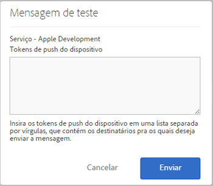

# Prerequisites to enable push messaging {#prerequisites-to-enable-push-messaging}

Você deve concluir essas tarefas antes de configurar as mensagens de push em seus aplicativos.

## Ativar a Experience Cloud para sua empresa

Sua empresa do Adobe Analytics deve ter a Experience Cloud habilitada. Você pode verificar o status do executivo de sua conta da Adobe.

## Instalar e configurar o SDK móvel

* **Instalar o SDK do Mobile**

   Para configurar as mensagens de push, você deve baixar e instalar pelo menos a versão 4.6 ou posterior do SDK móvel. For more information, see [Download the SDKs](/help/using/c-manage-app-settings/c-mob-confg-app/t-config-analytics/download-sdk.md).

* **Configurar serviços de push**

   Você deve configurar serviços de push no SDK do Mobile.
Para obter mais informações, consulte o seguinte conteúdo:

   * [Mensagens de push no Android](/help/android/messaging-main/push-messaging/push-messaging.md)
   * [Mensagens de push no iOS](/help/ios/messaging-main/push-messaging/push-messaging.md)

## Logon nos serviços principais do Mobile usando sua Adobe ID

>[!IMPORTANT]
>
>Para usar a funcionalidade Serviços de push, os usuários devem fazer logon no Mobile Core Service usando sua Adobe ID e sua conta do Analytics deve estar vinculada às Adobe IDs deles. A funcionalidade serviços de push não será disponibilizada se os usuários fizerem logon usando suas contas existentes do Adobe Analytics.

Se os usuários não tiverem Adobe IDs, siga as seguintes etapas:

1. (**Experience Cloud Administrator**) Invite users to the Experience Cloud.

1. (**User**) Create a personal Adobe ID using the instructions that you received from the Experience Cloud administrator.

   Quando o administrador concluir a etapa anterior, todos os usuários receberão automaticamente uma mensagem por email.

1. (**Users**) Log in to Mobile using their Adobe ID.

## Vincular contas de usuários na Experience Cloud

Cada usuário deve vincular a conta da solução do Analytics a partir da organização da Experience Cloud.

1. Para fazer logon na Experience Cloud com uma Adobe ID, digite [https://marketing.adobe.com](https://marketing.adobe.com) em um navegador.

1. No canto superior direito, selecione o nome da empresa do Analytics.

1. Clique em **[!UICONTROL Adicionar organização]** e selecione **Adobe SiteCatalyst/Adobe Social]na lista suspensa.[!UICONTROL **

1. Digite o nome da empresa, suas credenciais herdadas para a empresa especificada e clique em **[!UICONTROL Vincular conta]**.

   A Adobe ID agora está vinculada às suas credenciais de conta, empresa e logon do Analytics.

Para obter mais informações, consulte [Resolução de problemas na vinculação da conta](https://marketing.adobe.com/resources/help/en_US/mcloud/organizations.html).

## Configurar serviços de push e o serviço de ID do SDK na interface do usuário móvel

Antes de habilitar o Serviço de ID para o aplicativo, a seção **[!UICONTROL Serviços de push]é desabilitada.** But, after you enable the ID service, the Push Services section is enabled. Para obter mais informações sobre como ativar serviços de push, consulte [Configurar opções](/help/using/c-manage-app-settings/c-mob-confg-app/t-config-visitor.md)do serviço de ID do SDK.

>[!IMPORTANT]: Você deve clicar em **[!UICONTROL Salvar]** para salvar as alterações e atualizar os Serviços de push.
>
>É possível configurar um aplicativo da app store para a Apple e um para o Google em cada conjunto de relatórios. Se precisar de aplicativos adicionais, por exemplo, um para um ambiente de produção e outro para um ambiente de desenvolvimento, defina um novo aplicativo na app store e um novo conjunto de relatórios para cada ambiente.

* Para **Apple**, arraste e solte sua chave privada e/ou certificado. Se sua chave privada estiver criptografada por senha, digite a senha.

   * Para a **Chave privada**, arraste e solte seu arquivo de chave privada na caixa.

      Você também pode clicar em **[!UICONTROL Navegar]para selecionar o arquivo.** Esse arquivo possui a chave privada. The certificate might also be included in this file (`.p12`, `pkcs12`, `.pfx`, `.key`, `.pem`).

   * Para obter a **Senha da chave privada**, se seu arquivo de chave privada estiver criptografado, digite a senha.

      (Condicional) Para o **Certificado**, arraste e solte o arquivo do certificado na caixa. Você também pode clicar em **[!UICONTROL Navegar]para selecionar o arquivo.** This field is not required if the private-key file also contains the certificate ( `.cert`, `.cer`, `.crt`, `.pem`).

* Para o **Google**, especifique a chave de API do aplicativo.

   Clique em **[!UICONTROL Testar]para validar se o aplicativo e o Mobile Services estão configurados corretamente.** Essa opção é útil para a depuração e resolução de problemas.

   Digite os tokens de push do dispositivo que você deseja enviar a mensagem. Você pode enviar a mensagem para vários dispositivos especificando tokens em uma lista separada por vírgula.

   
