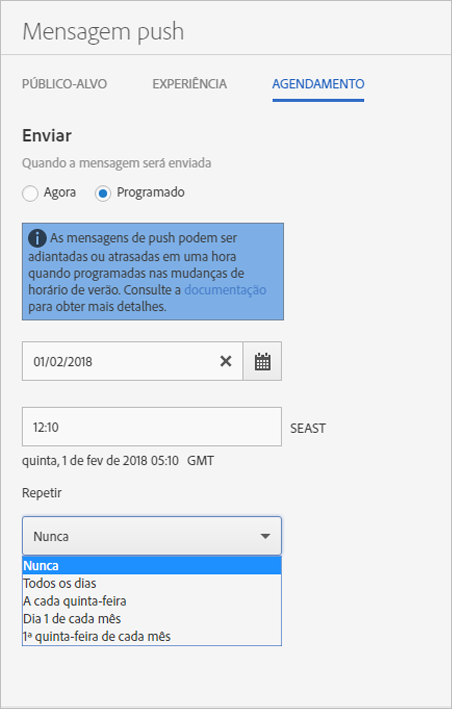

# Programar: mensagens por push {#schedule-push-message}

{#eol}

Na interface do usuário do Adobe Mobile Services, você pode agendar uma mensagem de push para ser entregue imediatamente, para ser entregue posteriormente e como um evento recorrente. Esses eventos podem ser agendados de forma diária, semanal ou mensal.

>[!TIP]
>
>Os usuários podem modificar as configurações de programação para uma tarefa de mensagem por push a qualquer momento. Se não houver uma data aplicável para enviar uma mensagem recorrente programada, por exemplo, uma tarefa mensal recorrente a cada 31 dias, no dia 31 de fevereiro ou na quinta terça-feira do mês, nenhuma mensagem será enviada.

Lembre-se das seguintes informações:

* O formato correto de data e hora é `hh:mm` e `mm/dd/yyyy`.

* Você pode editar uma mensagem agendada das seguintes maneiras:

   * Mudar a data para uma data posterior.
   * Altere o intervalo de repetição.

      Por exemplo, se originalmente você tinha uma mensagem que era enviada todos os dias, é possível alternar a recorrência para semanalmente.

## Antes de agendar mensagens por push recorrentes

Você **deve** compreender as seguintes informações antes de agendar mensagens de push recorrentes:

* As opções exibidas na lista suspensa **[!UICONTROL Repetir]** dependem da data que você digitou ou selecionou.

   Por exemplo, se você digitou `Saturday, October 7`, as seguintes opções são exibidas:

   * **[!UICONTROL Nunca]**
   * **[!UICONTROL Todos os dias]**
   * **[!UICONTROL Todos os sábados]**
   * **[!UICONTROL Dia 7 de cada mês]**
   * **[!UICONTROL 1º sábado de cada mês]**

* As mensagens de push são programadas e enviadas com base no Horário de Greenwich (GMT).

   Por exemplo, se você agendar uma mensagem recorrente para ser enviada todos os sábados às 12h (meio-dia) **PST**, a partir de 7 de outubro, a mensagem será enviada no sábado às 19h **GMT**.
* As mensagens são enviadas de forma diferente de acordo com a sua localização: Estados Unidos, Europa ou Ásia.

   Por exemplo, se você estiver em San Jose, Califórnia, e agendar uma mensagem para ser enviada em ***31 de outubro*** às 17h30 **PST**, ela será enviada em ***1 de novembro*** às 12h30 **GMT**. Se você estiver em Tóquio e agendar uma mensagem para ser enviada em ***1 de janeiro*** às 5h30, ela será enviada em ***31 de dezembro*** às 20h30 **GMT**.
* As mensagens de push são enviadas uma hora antes ou depois, dependendo de quando ocorre o horário de verão.
* Ao olhar para seu relatório de mensagens de push, a mensagem é exibida no fuso horário local do seu sistema.

   Por exemplo, se a hora de início for 12h **PST**, embora a mensagem seja enviada às 19h **GMT**, o relatório de mensagem exibirá a hora de envio como 12h **PST**.

## Programar uma mensagem por push recorrente {#section_675BD754E5A04423A1751193698A978F}

1. Na página Programação de uma nova mensagem por push, selecione **[!UICONTROL Programada]** ou **[!UICONTROL Agora]**.

   Para obter mais informações, consulte [Criar uma mensagem por push](/help/using/in-app-messaging/t-create-push-message/t-create-push-message.md).

   Se você selecionou **[!UICONTROL Agora]**, a mensagem será enviada imediatamente. Para evitar que a mensagem seja agendada imediatamente, clique em **[!UICONTROL Salvar como rascunho]**.

   

1. Se você selecionou **[!UICONTROL Programada]**, clique no ícone do calendário e selecione ou digite uma data de início.
1. Digite uma hora. 
1. Em **[!UICONTROL Repetir]**, selecione uma das seguintes opções:

   * **[!UICONTROL Nunca]**
   * **[!UICONTROL Todos os dias]**
   * **[!UICONTROL Todas as terças-feiras]**
   * **`<Day x>`do mês**

      As opções exibidas mudam de acordo com o dia selecionado ou digitado como o dia de início.
   * **`<nth day>`de cada mês**

      O valor exibido muda de acordo com a data que você selecionou ou digitou como a data de início.

1. Em **[!UICONTROL Fim da repetição]**, digite uma data e hora de término.
1. Clique em uma das seguintes opções:

   * **[!UICONTROL Salvar como rascunho]**

      Esta opção salva a mensagem no formato de rascunho. Você pode escolher essa opção para salvar uma mensagem não finalizada ou para salvar a mensagem de modo que uma pessoa edite-a e aprove-a antes de ativá-la.

      Se você selecionou **[!UICONTROL Agora]** na etapa anterior, a mensagem de rascunho é enviada imediatamente após a ativação. Caso tenha selecionado a data e a hora para encaminhar a mensagem, ela será encaminhada de acordo com essa programação.

   * **[!UICONTROL Salvar e agendar]**

      Essa opção envia a mensagem no dia e na hora agendados.

Para enviar a mensagem de rascunho mais tarde, conclua uma das seguintes tarefas:

* Clique em **[!UICONTROL Gerenciar mensagens]**, marque a caixa de seleção ao lado da mensagem e clique em **[!UICONTROL Ativar mensagens selecionadas]**.
* Clique em **[!UICONTROL Salvar e enviar]** para salvar a mensagem e enviá-la.
