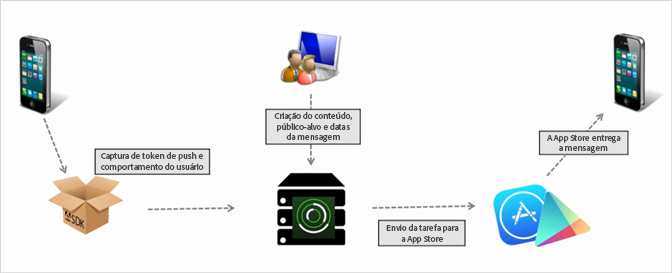

# Criar uma mensagem de push {#create-a-push-message}

Enviar mensagens de push para segmentos do Analytics por meio da interface do usuário do Mobile Services, utilizar os dados avançados do Analytics e garantir a participação dos usuários.

>[!IMPORTANT]
>
>Antes de criar uma mensagem por push, consulte [Pré-requisitos para ativar as mensagens por push](/help/using/c-manage-app-settings/c-mob-confg-app/configure-push-messaging/prerequisites-push-messaging.md).

As mensagens de push são exibidas para os usuários que optaram por receber notificações quando não estiverem usando ativamente seu aplicativo. Essas notificações alertam os usuários sobre novas atualizações, ofertas e lembretes. Com essas notificações, é possível criar, testar, gerenciar e gerar relatórios sobre as mensagens por push em um fluxo de trabalho simplificado.

As mensagens de push são enviadas pelo lado do servidor pelas lojas de aplicativos e não pelo Adobe Mobile Services:

Para criar uma mensagem por push:

1. Clique em ***nome_do_aplicativo*** > **[!UICONTROL Mensagens]** > **[!UICONTROL Gerenciar mensagens]** > **[!UICONTROL Criar mensagem]** > **[!UICONTROL Criar mensagem de push]**.
1. Configurar as opções de público.

   Para obter mais informações, consulte [Público: definir e configurar segmentos de público para mensagens por push](/help/using/in-app-messaging/t-create-push-message/c-audience-push-message.md).
