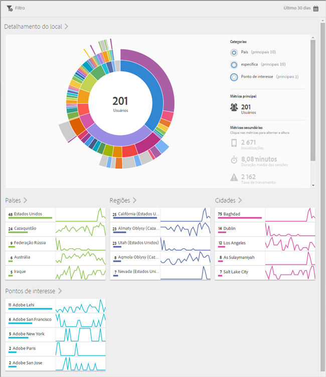
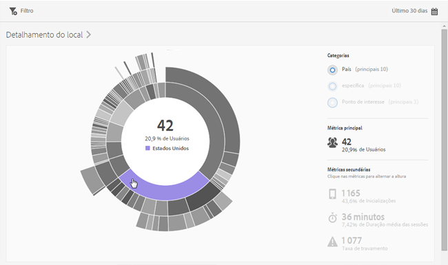
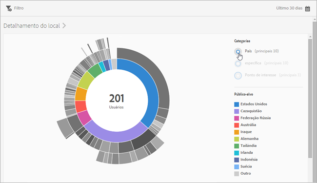
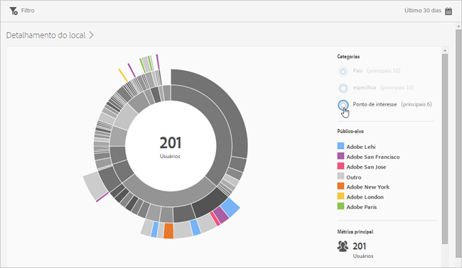
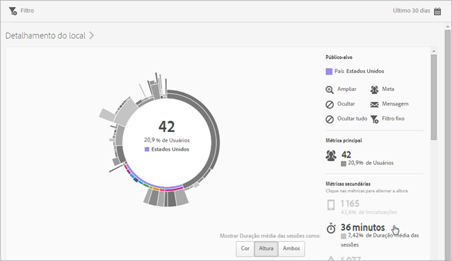
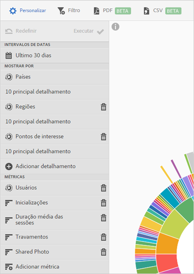

# Visão geral (Localização){#overview-location}

O relatório **[!UICONTROL Visão geral de localização]** permite visualizar os diferentes países, regiões e Pontos de interesse (POIs) nos quais seu aplicativo está sendo usado.

Este relatório fornece uma visualização em forma de raio de sol dos dados existentes, e você pode usar o relatório para descobrir segmentos de público-alvo (coleções de visitantes) para segmentação. A criação e o gerenciamento de públicos-alvo é semelhante à criação e utilização de segmentos, exceto a possibilidade de disponibilizar os públicos-alvo na Experience Cloud.

Estas são algumas informações adicionais sobre este relatório:

## Navegação e utilização {#section_4A88C3849B5847BF8CF433CCFD99FDC3}

Essa visualização fornece, por exemplo, o relatório base com detalhamentos. A visualização usa a altura para mostrar a métrica em foco e as diferenças de desempenho entre as métricas. Cada anel representa um segmento de público alvo na categoria do anel. É possível realizar ações em um público alvo, como aplicar um filtro fixo, ocultar uma métrica e visualizar métricas.

>[!TIP]
>
>Além dessas informações, você pode ver um tutorial no produto que descreve como interagir com o gráfico de explosão solar. Para abrir o tutorial, clique em **[!UICONTROL Detalhamento do local]** na barra de título do relatório e no ícone **[!UICONTROL i]**.

O gráfico em forma de raio de sol é interativo. Você pode alterar o período de tempo, clicando no ícone **[!UICONTROL Calendário]** no lado superior direito. Passe o mouse sobre qualquer parte do gráfico para exibir mais informações. Por exemplo, na ilustração a seguir, é possível ver o número total e a porcentagem de usuários que usam seu aplicativo nos Estados Unidos.

Nesta ilustração, os botões **[!UICONTROL Categorias]** no canto superior direito permitem alternar entre a exibição de informações sobre dez países ou regiões principais, e três **[!UICONTROL pontos de interesse]** principais.

Quando você seleciona **[!UICONTROL País]** esta é a visualização:

Quando você seleciona **[!UICONTROL Pontos de interesse]** esta é a visualização:

Clique em uma parte do anel para selecionar o público-alvo no qual você pode realizar ações, como ampliar, ocultar públicos-alvo, criar uma mensagem no aplicativo ou um filtro fixo.

Você pode clicar em uma métrica secundária no lado direito para adicioná-la à visualização e exibi-la usando cor, altura ou ambas.

## Adicionar detalhamentos e métricas {#section_15833511E82648869E7B1EFC24EF7B82}

É possível adicionar detalhamentos e métricas secundárias, que podem alterar a altura de cada público-alvo em relação aos outros públicos no gráfico.

>[!TIP]
>
>Quanto mais anéis você adicionar ao gráfico, mais demorado será o processamento.

Para adicionar detalhamentos e métricas secundárias, clique em **[!UICONTROL Detalhamento do local]** na barra de título do relatório e em **[!UICONTROL Personalizar]** para abrir o painel direito.

Ao clicar em **[!UICONTROL Adicionar detalhamento]** ou **[!UICONTROL Adicionar métrica]**, um novo item é exibido com o mesmo nome do item anterior na respectiva lista. Clique na métrica ou detalhamento criado recentemente para acessar uma lista suspensa na qual poderá selecionar um novo item.

## Criar um filtro fixo {#section_365999D49FC744ECBF9273132497E06C}

Clique em uma parte do anel para selecionar o público-alvo para o qual deseja criar um filtro fixo e clique em **[!UICONTROL Filtro fixo]**. O filtro fixo permite que você aplique os filtros atuais e execute um novo relatório com base neles.

## Compartilhar relatórios   {#section_F8AF2AA73D4C4C008976D45847F82D0B}

Após a criação de um relatório, suas configurações são usadas para criar um URL personalizado, que pode ser copiado e compartilhado.

## Informações adicionais

Para obter mais informações sobre localização, consulte o seguinte conteúdo:

* [Mapa](/help/using/location/c-map-points.md)
* [Gerenciar pontos de interesse](/help/using/location/t-manage-points.md)
