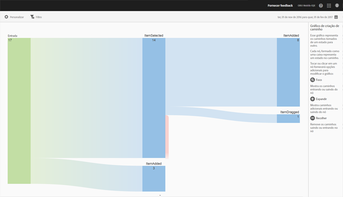

# Relatório dos Caminhos de ação{#action-paths}

O relatório Caminhos de ação se baseia na análise de caminhos e mostra um gráfico que representa os caminhos que foram tomados de um estado para outro no aplicativo.

Ambos os relatórios **[!UICONTROL Caminhos de exibição]** e **Caminhos de ação]são relatórios de definição de caminho.[!UICONTROL ** O relatório **[!UICONTROL Caminhos de exibição]mostra como os usuários navegam no seu aplicativo de uma tela para outra.** O relatório **[!UICONTROL Ações de exibição]mostra a sequência de ações e eventos, como cliques, seleções, redimensionamento, etc., que os usuários executam no aplicativo.**

>[!TIP]
>
>You can use a funnel report to combine navigation and actions in one report. For more information, see Funnel.

Cada nó, formado como uma caixa, representa um estado nos caminhos dos usuários em um aplicativo. Por exemplo, no gráfico acima, o nó superior representa o número de usuários que inicializaram o aplicativo e escolheram uma foto da galeria.

Para exibir as opções para modificar o gráfico, clique em um nó e em **[!UICONTROL Focar]** ou **[!UICONTROL Expandir]**. Por exemplo, se você clicar no estado **[!UICONTROL PhotoPicked]** no nó superior, os ícones **[!UICONTROL Focar]e** Expandir] serão exibidos.**[!UICONTROL **

To expand, click the **[!UICONTROL +]** icon. Esta opção exibe os caminhos adicionais que entram ou saem do nó. No gráfico abaixo, o estado 1 é a inicialização do aplicativo, o estado 2 é a seleção de uma foto (o item expandido anteriormente) e o estado 3 inclui os diferentes caminhos que os usuários tomaram:

* Seleção de um item
* Adição de um item
* Arrastar um item
* Dimensionamento de um item

Expandir um estado é como um funil.

To isolate the node and show paths that come into, and go out of the selected node, click the   icon. No gráfico abaixo, os seguintes caminhos foram concluídos **antes** dos usuários selecionarem uma foto:

* Rotação de um item
* Dimensionamento de um item
* Arrastar um item
* Remoção de um item

Dos usuários que selecionaram uma foto, os seguintes caminhos foram concluídos **após** a seleção da foto:

* Seleção de um item
* Adição de um item
* Arrastar um item
* Dimensionamento de um item

Você pode focalizar ou expandir vários nós para conseguir uma visualização detalhada dos caminhos que os usuários percorrem em seu aplicativo. Por exemplo:

Você pode configurar as seguintes opções no relatório:

* **[!UICONTROL Período de tempo]**

   Clique no ícone **[!UICONTROL Calendário]e selecione um período de tempo personalizado ou escolha um período de tempo predefinido na lista suspensa.**

* **[!UICONTROL Personalizar]**

   Personalize seus relatórios alterando as opções **[!UICONTROL Mostrar por], adicionando métricas e filtros e adicionando séries (métricas) e muito mais.** For more information, see [Customize reports](/help/using/usage/reports-customize/reports-customize.md).

* **[!UICONTROL Filtro]**

   Clique em **[!UICONTROL Filtro]para criar um filtro que abrange vários relatórios e observar o desempenho de um segmento específico em todos os relatórios móveis.** Um filtro fixo permite definir um filtro aplicado a todos os relatórios não relacionados à definição de caminho. Para obter mais informações, consulte [Adicionar um filtro](/help/using/usage/reports-customize/t-sticky-filter.md)fixo.

* **[!UICONTROL Baixar]**

   Click **[!UICONTROL PDF]** or **[!UICONTROL CSV]** to download or open documents and share with users who do not have access to Mobile Services or to use the file in presentations.