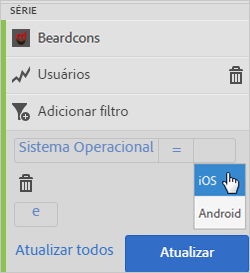
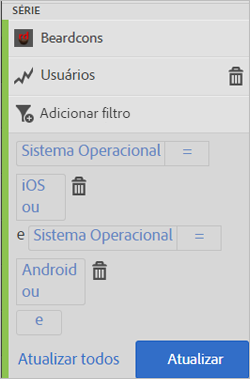
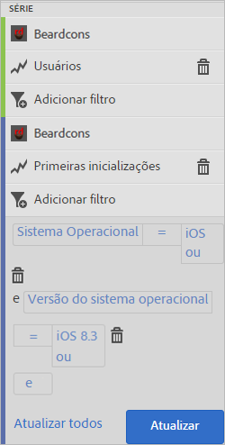

# Add filters to reports{#add-filters-to-reports}

Estas informações ajudam você a personalizar os relatórios internos, adicionando filtros (segmentos).

>[!IMPORTANT]
>
>As métricas do aplicativo móvel também estão disponíveis em relatórios e análises de marketing, análise ad hoc, data warehouse e outras interfaces de relatórios do Analytics. Se um detalhamento ou tipo de relatório não estiver disponível no Adobe Mobile, poderá ser gerado usando uma interface de relatórios diferente.

Neste exemplo, vamos personalizar o relatório **[!UICONTROL Usuários e sessões], mas as instruções se aplicam a todos os relatórios.**

1. Abra o aplicativo e clique em **Utilização** &gt; **[!UICONTROL Usuários e sessões]**.

   

   Esse relatório fornece uma visualização completa dos nossos usuários do aplicativo. No entanto, as métricas para as versões desse aplicativo para iOS e Android são coletadas no mesmo conjunto de relatórios. Podemos segmentar os usuários por sistema operacional móvel, adicionando um filtro personalizado à métrica Usuários.

1. Click **[!UICONTROL Customize]**.

   

1. Under **[!UICONTROL Users]**, click **[!UICONTROL Add Filter]** and click **[!UICONTROL Add Rule]**.

1. Select **[!UICONTROL Operating Systems]**, and from the drop-down list, and select **[!UICONTROL iOS]**.

   

   Para adicionar Android como filtro, é necessário repetir essa etapa.

1. Click **[!UICONTROL And]**, select **[!UICONTROL Operating Systems]** from the drop-down list, and select **[!UICONTROL Android]**.

   Agora, seus filtros terão o mesmo visual do exemplo abaixo:

   

1. Clique **[!UICONTROL Atualizar]**.
1. To regenerate the report, click **[!UICONTROL Run]**.

   Esse relatório agora mostra os usuários detalhados por sistema operacional. O título do relatório foi alterado para corresponder aos filtros aplicados ao relatório.

   

   Você pode personalizar este relatório mais. No iOS 8.3, você pode adicionar a métrica Primeiras inicializações com um filtro de versão do sistema operacional iOS 8.3 para ver quantos clientes iOS 8.3 atualizaram seus aplicativos e fizeram uma primeira inicialização.
1. Under **[!UICONTROL First Launches]**, click **[!UICONTROL Add Filter]**, click **[!UICONTROL Add Rule]**, select **[!UICONTROL Operating Systems]** from the drop-down list, and select **[!UICONTROL iOS]**.
1. Click **[!UICONTROL And]**, select **[!UICONTROL Operating System Versions]** from the drop-down list, and select **[!UICONTROL iOS 8.3]**.

   Agora, seus filtros serão iguais ao exemplo abaixo:

   

1. Click **[!UICONTROL Update]** and **[!UICONTROL Run]**.

   Esse relatório agora mostra os usuários com iOS 8.3 que inicializaram o aplicativo pela primeira vez.

   

   Teste as diferentes opções no menu de personalização do relatório e certifique-se de marcar suas opções favoritas. Os URLs de relatório no Adobe Mobile estão funcionais e podem ser enviados por email ou adicionados aos favoritos.
