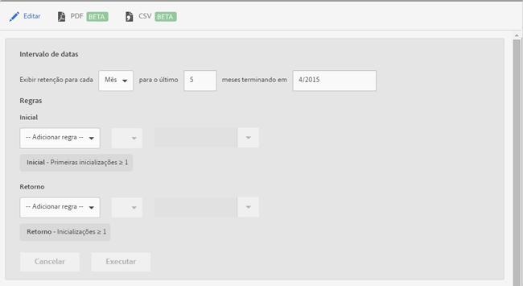

# Relatório de retenção {#retention}

O relatório **[!UICONTROL Retenção](antigo Coorte da primeira inicialização) é um relatório de coorte que mostra quantos usuários únicos inicializaram o aplicativo pela primeira vez e, então, inicializaram-no novamente pelo menos uma vez durante os meses seguintes.**

Por padrão, esse relatório mostra a retenção de grupos de usuários com base no momento em que inicializaram o aplicativo pela primeira vez. Também é possível personalizar este relatório para usar uma métrica diferente de Primeira inicialização e adicionar ações adicionais.

Um coorte é um grupo de pessoas que compartilham uma característica ou experiência em comum em um período de tempo definido. O relatório **[!UICONTROL Retenção]reúne as características comuns dos usuários que instalaram o aplicativo em um dia, semana ou mês específico e gera um gráfico com o número de usuários que inicializarão o aplicativo nos próximos X dias, semanas ou meses.** O relatório mostra quão bem os visitantes foram retidos como ativos ou engajados.

Este é um exemplo desse relatório:

Na coluna **[!UICONTROL M0], o número total de pessoas que inicializaram o aplicativo pela primeira vez em novembro de 2014 é exibido.** Na coluna **[!UICONTROL M1], o número de pessoas que inicializaram o aplicativo novamente em dezembro de 2014, e assim por diante, é exibido.**

Para alterar o intervalo de datas ou editar as regras do relatório, clique em **[!UICONTROL Editar]**.

O relatório pode ser preenchido por qualquer variável ou métrica, incluindo as medições de ciclo de vida, mas excluindo as métricas calculadas.
